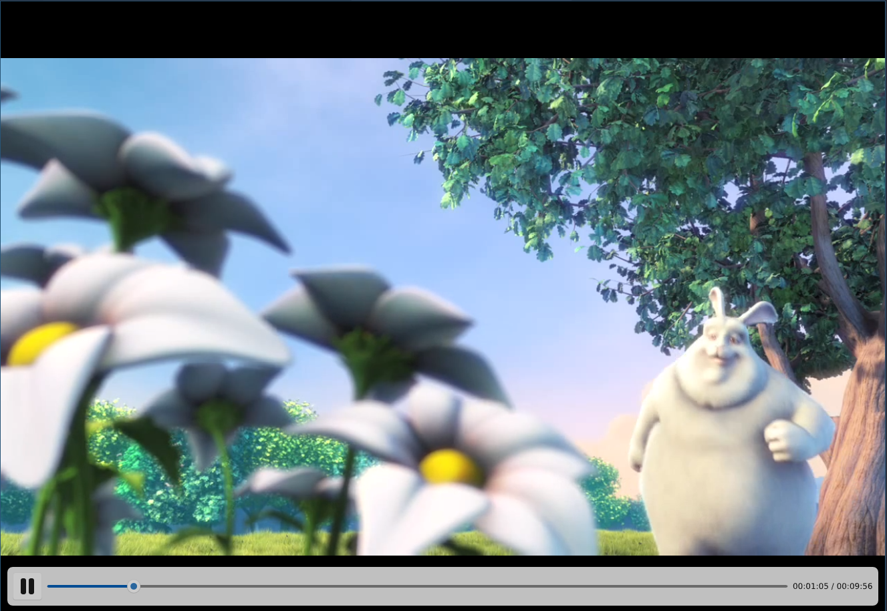
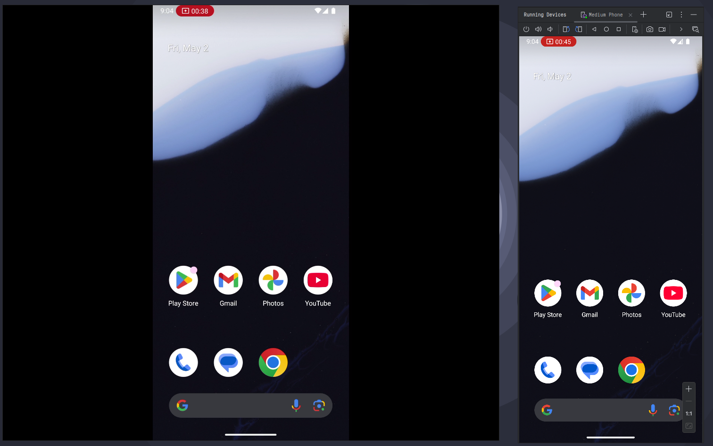

> [!WARNING]
> This is an actively developed project and is intended solely for testing purposes at this stage.

# OpenMirroring

OpenMirroring is a suite of programs that allows for easy mirroring of displays and windows from one device to another.
The suite consists of two programs, a sender and a receiver, that both implement the [FCast](https://fcast.org/) protocol.

### Platform support

The current platform support matrix looks like this:

#### Desktop

|            |Linux (Wayland)  |Linux (X11)  |Windows  |MacOS     |
|------------|-----------------|-------------|---------|----------|
|OMSender    |Yes              |Yes          |Yes      |No        |
|OMReceiver  |Yes              |Yes          |Yes      |Untested  |

OMSender can cast to other FCast receivers as well.

OMReceiver is also an FCast receiver.

*OMReceiver playing Big Buck Bunny*

#### Mobile

`android-sender/` contains a proof of concept sender implementation for Android. It's barely usable with
extremely high latency as one can see from the clock in the top left corner in the screenshot above.

### Installing

TODO
